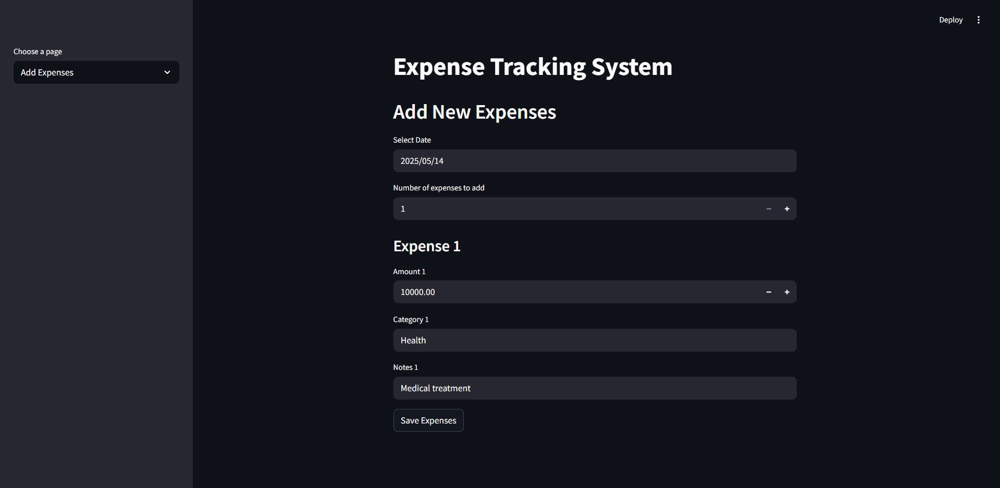
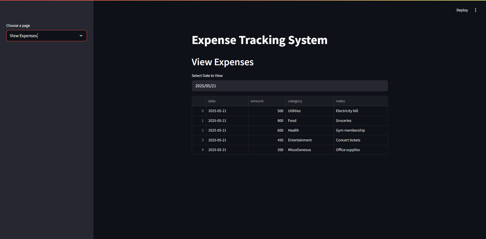
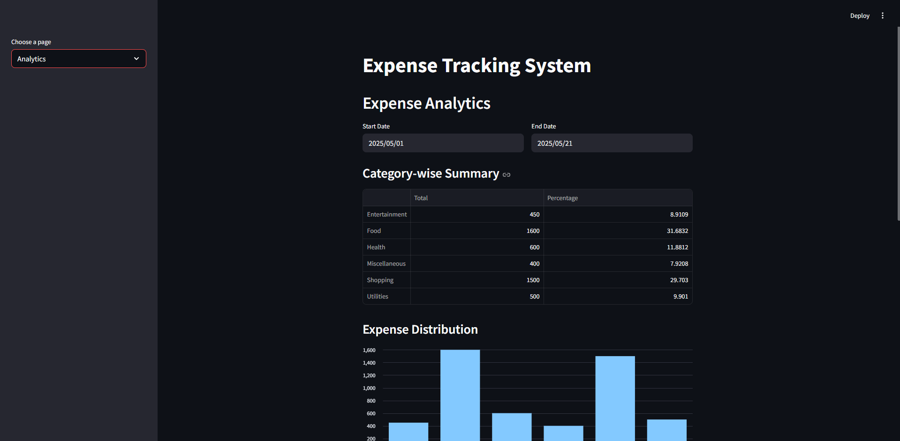

# 💰 Expense Tracking System

A powerful, user-friendly expense tracking system designed to help you manage and analyze your personal or business expenses with ease. This application provides a modern interface for adding, viewing, and analyzing expenses, complete with interactive charts and detailed analytics.

## 📸 Screenshots

- **Add Expenses**
  
  

- **View Expenses**
  
  

- **Analytics**
  
  

## 🔍 Overview

This expense tracking system is built to simplify the process of managing your finances. It allows you to record expenses, view them by date, and analyze spending patterns through interactive charts. The system is designed to be intuitive and efficient, making it easy for users to keep track of their expenses without the need for complex database setups.

## ✨ Key Features
- Add, view, and analyze your expenses easily
- Category and monthly analytics with charts
- No database setup required (uses local file storage)
- Clean, modern UI (see screenshots above)

## 🔧 Installation
1. Clone the repository:
   ```bash
   git clone https://github.com/yourusername/project-expense-tracking-system.git
   cd project-expense-tracking-system
   ```
2. Install dependencies:
   ```bash
   pip install -r requirements.txt
   ```

## 🚀 Usage
Run the app with Streamlit:
```bash
streamlit run backend/server.py
```

## 📖 How to Use
- **Add Expenses:** Enter date, amount, category, and notes, then save.
- **View Expenses:** Select a date to see all expenses for that day.
- **Analytics:** Select a date range to see category-wise and monthly summaries with charts.

## 🧪 Testing
Run tests with:
```bash
pytest
```

## 💻 Technologies Used
- Python, Streamlit, Pandas

## 📁 Data Storage

- All expense data is stored in a local file named `expenses.json` in the project directory.
- No external database or credentials are required.
- Data is persistent between app restarts (unless the file is deleted).

## 🔒 Security & Privacy

- All data is stored locally on your machine.
- No data is sent to external servers.
- You can back up or move your `expenses.json` file as needed.

## 📋 Future Improvements

- User authentication and multi-user support
- Export data as CSV or Excel
- More advanced analytics (e.g., forecasting)
- Mobile-friendly UI
- Cloud storage integration

## 🙋 FAQ

**Q: Do I need to install MySQL or any other database?**  
A: No, all data is stored in a local JSON file.

**Q: Can I use this on another computer?**  
A: Yes, just copy the project folder (including `expenses.json`) to the new machine.

**Q: How do I reset all data?**  
A: Delete the `expenses.json` file in the project directory.

*Enjoy tracking your expenses!*

